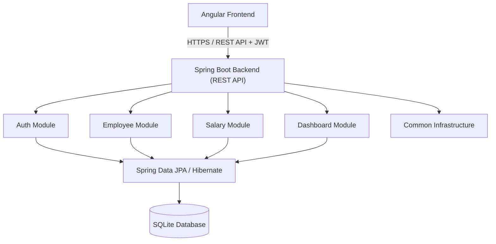

# Salary Management System — Architecture

## 1. Architecture Overview

The system uses a **modular monolith** architecture: a single deployable Spring Boot application, internally organized into cohesive, feature-oriented modules (auth, employee, salary, dashboard, common), backed by a single Angular frontend.

This is appropriate for the current scale and scope because:

- The organization has approximately 10,000 employees and a single primary user role (HR Manager) — this is a small-to-medium data and load profile that does not require independently scaled services.
- A single relational database (SQLite) is sufficient; there is no need to partition data or ownership across services.
- A modular monolith keeps deployment, transactions, and data consistency simple (one process, one database, no distributed transactions or network calls between modules).
- Module boundaries (auth, employee, salary, dashboard, common) still enforce separation of concerns and give a clear path to extraction later, without paying the operational cost of microservices (service discovery, inter-service networking, distributed tracing, independent deployments) up front.
- It keeps the system easier to build, test, reason about, and maintain with a small team.

High-level flow:

```
Angular frontend
        |
        | HTTPS / REST API + JWT
        v
Spring Boot backend
        |
        +-- Auth module
        +-- Employee module
        +-- Salary module
        +-- Dashboard module
        +-- Common infrastructure
        |
        v
Spring Data JPA / Hibernate
        |
        v
SQLite database
```

## 2. Technology Stack

- **Java 21** — backend language runtime.
- **Spring Boot** — application framework (web, dependency injection, configuration).
- **Spring Data JPA / Hibernate** — ORM and repository-based data access.
- **SQLite** — relational database for persistence.
- **Angular** — frontend SPA framework.
- **TypeScript** — frontend language.
- **JWT (JSON Web Tokens)** — stateless authentication mechanism.
- **JUnit 5** — backend unit/integration testing framework.
- **Mockito** — mocking framework for backend tests.

No additional technologies (messaging systems, caches, container orchestration, etc.) are introduced beyond what the requirements call for.

## 3. Backend Architecture

The backend is organized by **feature/module** rather than by technical layer at the top level:

```
auth/
employee/
salary/
dashboard/
common/
```

- **auth** — login endpoint, JWT issuance/validation, security configuration.
- **employee** — employee CRUD, search, filtering, pagination.
- **salary** — salary record creation, salary history, current-salary derivation.
- **dashboard** — salary insights and aggregate statistics.
- **common** — shared infrastructure: DTO base types, exception handling, shared validation utilities, common configuration.

Within each business module, a simple layered flow is used:

```
Controller → Service → Repository → Database
```

- **Controller** — accepts HTTP requests, validates request shape (via DTOs/bean validation), delegates to the service layer, and maps results to HTTP responses. Contains no business logic.
- **Service** — contains business logic and orchestrates use cases (e.g., "create a salary record", "compute dashboard statistics"). Enforces domain rules (e.g., positive salary amounts, uniqueness) and coordinates repositories.
- **Repository** — Spring Data JPA interfaces responsible for data access only (queries, persistence). No business logic.
- **Database** — SQLite, accessed exclusively through the repository layer.

No additional layers (e.g., separate "manager" or "facade" layers, generic repository abstractions beyond Spring Data, or CQRS-style splitting) are introduced, since they are not needed at this scale.

## 4. Frontend Architecture

The Angular application uses a feature-oriented structure:

```
core/
  auth/
  guards/
  interceptors/
  services/

shared/
  components/
  models/
  services/

features/
  login/
  dashboard/
  employees/
  salary/
```

- **Authentication handling** — the `core/auth` area holds the authentication service responsible for login, logout, and tracking the current authentication state.
- **JWT storage/handling** — on successful authentication, the frontend securely manages the JWT and attaches it to subsequent authenticated API requests. The exact client-side token storage mechanism will be selected during implementation based on the security trade-offs.
- **Route guards** — `core/guards` contains guards that prevent navigation to protected routes (employee, salary, dashboard views) unless a valid JWT is present, redirecting unauthenticated users to login.
- **HTTP interceptor** — `core/interceptors` contains an interceptor that attaches the JWT to outgoing API requests and handles authentication-related error responses (e.g., redirecting to login on a 401).
- **API services** — `core/services` and `shared/services` contain services responsible for calling backend REST endpoints (employee, salary, dashboard) and returning typed data to components.
- **Feature components** — `features/` contains one folder per screen/capability (login, dashboard, employees, salary), each composed of the components needed for that feature (e.g., employee list, employee detail/edit, salary history).
- **Shared reusable components** — `shared/components` holds presentational components reused across features (e.g., pagination control, table, form controls), and `shared/models` holds TypeScript interfaces/types shared across features.

This structure is kept practical: it separates cross-cutting infrastructure (`core`), reusable UI (`shared`), and screen-specific code (`features`), without introducing state-management libraries or architectural patterns beyond what a single-role, moderately sized application needs.

## 5. Authentication and Security

Planned JWT authentication flow:

```
Login
  → backend validates credentials
  → JWT generated
  → frontend stores token
  → interceptor sends token with protected requests
  → backend validates JWT
  → protected resources become accessible
```

- The HR Manager submits credentials via the login screen.
- The backend `auth` module validates the credentials and, on success, issues a signed JWT.
- The frontend stores the JWT and includes it (via the HTTP interceptor) on subsequent requests to protected endpoints.
- The backend validates the JWT on each protected request before allowing access.
- All employee, salary, and dashboard endpoints require a valid JWT; unauthenticated requests are rejected.

Because there is a single primary user role (HR Manager), authentication is intentionally simple: it verifies *who* the caller is, without a role/permission hierarchy, resource-level authorization matrix, or multi-tenancy concerns. No additional roles or permission levels are introduced beyond what the requirements specify.

## 6. Data Access

- **Spring Data JPA / Hibernate** is used as the ORM, mapping entities (Employee, SalaryRecord) to SQLite tables.
- **Repository-based data access**: each business module exposes Spring Data JPA repository interfaces; all persistence access goes through repositories rather than raw SQL or direct JDBC calls, using JPA-generated or `@Query`-defined parameterized queries.
- **Entity relationships**: Employee to SalaryRecord is a one-to-many relationship (see `domain-model.md`), modeled via standard JPA associations.
- **Transaction boundaries**: transactions are scoped at the service-method level (e.g., a single `@Transactional` service method handles "add salary record" as one unit of work), keeping each use case atomic and consistent.
- **SQLite persistence**: SQLite is used as a single embedded/file-based relational database, accessed through the standard JPA/Hibernate JDBC driver integration, suitable for the read/write profile of ~10,000 employees and their salary history.

## 7. API Design Principles

- APIs use standard RESTful HTTP methods (GET, POST, PUT/PATCH) mapped to resource-oriented endpoints (e.g., employees, salary records).
- Controllers expose and accept **DTOs**, not persistence entities directly, keeping the API contract independent of the database schema.
- Incoming requests are validated (e.g., via bean validation) before reaching business logic.
- Endpoints return meaningful HTTP status codes (e.g., 200/201 for success, 400 for validation errors, 401/403 for authentication/authorization failures, 404 for missing resources).
- Error responses follow a consistent, predictable structure across the API.
- Employee list endpoints support pagination and filtering (by country, department) and search (by name or employee number) as query parameters.

The full API specification (exact endpoints, request/response schemas) is intentionally not defined here and will be documented separately.

## 8. Performance Considerations

To support approximately 10,000 employees efficiently:

- Employee listing uses **server-side pagination** rather than returning full result sets.
- Searching and filtering (by name, employee number, country, department) are performed at the **database level** via JPA/Hibernate queries, not in application memory.
- **Database indexes** are used on frequently queried fields (see `domain-model.md`) to keep search/filter/lookup performant.
- **Dashboard/insight statistics** (counts, min/max/average salary, distributions) are computed via database-level aggregation queries rather than loading all records into the application and computing in memory.
- The application avoids loading the full employee or salary dataset into memory at once.
- Entity relationships and queries are designed to avoid unnecessary N+1 query patterns (e.g., using appropriate fetch strategies/joins when retrieving related data such as an employee's latest salary record).
- Seed data generation is deterministic and reproducible, so environments and tests behave consistently.

No specific benchmark numbers or SLAs are defined, since none were specified in the requirements.

## 9. Error Handling

Centralized exception handling is planned using Spring's exception-handling mechanisms (e.g., a global exception handler), covering:

- **Validation errors** — invalid request payloads (e.g., a non-positive salary amount) return a 400-level response describing what was invalid.
- **Resource-not-found errors** — requests referencing a non-existent employee or salary record return a 404-level response.
- **Business-rule violations** — e.g., attempting to create a salary record without a valid effective date or currency return an appropriate 400-level response with a clear message.
- **Authentication/authorization errors** — missing, invalid, or expired JWTs return 401; disallowed access returns 403.
- **Unexpected server errors** — unhandled failures return a generic 500-level response.

All error responses follow a consistent shape and do not expose internal details (stack traces, SQL, internal class names) to the client.

## 10. Maintainability

The architecture supports maintainability through:

- **Separation of responsibilities** — each module owns a distinct area (auth, employee, salary, dashboard), and each layer within a module (controller/service/repository) has a single, clear responsibility.
- **Testability** — the layered structure allows services to be unit-tested with mocked repositories (via Mockito/JUnit 5), and controllers to be tested independently of business logic.
- **Readability** — a consistent, predictable structure (both backend modules and frontend feature folders) makes it straightforward to locate and understand code for a given feature.
- **Feature isolation** — changes to one module (e.g., dashboard insights) are unlikely to require changes in unrelated modules (e.g., auth).
- **Future extension** — new features can be added as new modules/feature folders following the same conventions; if the system later needs to scale beyond a single deployable unit, module boundaries provide a natural seam for extraction.

Object-oriented design and SOLID principles guide implementation (e.g., single-responsibility services, dependency injection for testability) as general engineering practice, not as justification for additional abstractions, patterns, or indirection beyond what the system currently needs.

## 11. Architectural Trade-offs

- **Modular monolith instead of microservices** — chosen because the scale (~10,000 employees, one primary user role) does not justify the operational complexity of independently deployed services, network calls between modules, or distributed data consistency. A single deployable unit is simpler to build, test, and operate.
- **SQLite instead of a separately managed database server** — chosen for simplicity of deployment (no separate database server/process to provision and manage) given the requirements; it is adequate for the expected data volume (~10,000 employees and their salary history).
- **JPA/Hibernate instead of handwritten persistence** — reduces boilerplate for standard CRUD and query needs while still allowing custom queries where required; avoids maintaining hand-rolled SQL/mapping code for straightforward entity persistence.
- **Server-side pagination/filtering instead of client-side** — keeps response payloads small and avoids transferring/holding the full ~10,000-employee dataset in the browser or application memory.
- **JWT for stateless authentication** — avoids server-side session storage/state, simplifying scaling and deployment, and is proportionate to a system with a single user role and straightforward authentication needs.

## 12. Architecture Diagram


