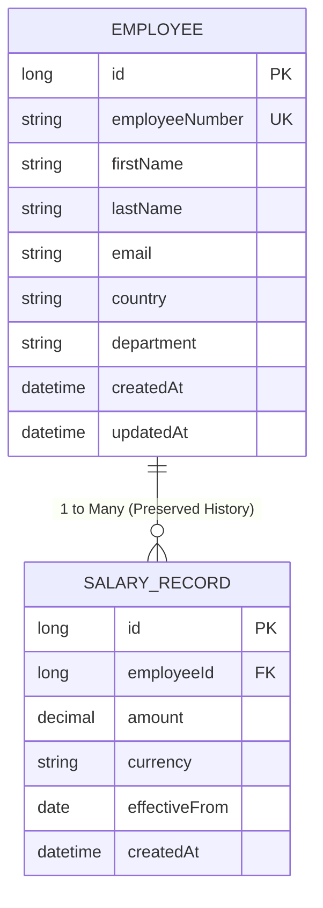

# Salary Management System — Domain Model

## 1. Employee Entity

Represents an employee within the organization.

### Fields
- `id` — Surrogate primary key (`Long`, auto-generated identity).
- `employeeNumber` — Unique business identifier for the employee (e.g., `EMP-00001`).
- `firstName` — Employee's first name.
- `lastName` — Employee's last name.
- `email` — Employee's work email address.
- `country` — Employee's primary country of employment.
- `department` — Department assignment (e.g., `Engineering`, `HR`, `Finance`).
- `createdAt` — Record creation timestamp (`Instant`).
- `updatedAt` — Record modification timestamp (`Instant`).

---

## 2. SalaryRecord Entity

Represents a historical or current salary entry for an employee, effective from a specified date.

### Fields
- `id` — Surrogate primary key (`Long`, auto-generated identity).
- `employee` — Many-To-One foreign key relationship referencing `Employee` (`employee_id`).
- `amount` — Monetary salary amount (`BigDecimal`, positive value with scale 2).
- `currency` — Three-letter ISO currency code (e.g., `USD`, `EUR`, `GBP`).
- `effectiveFrom` — Effective date from which this salary applies (`LocalDate`).
- `createdAt` — Record creation timestamp (`Instant`).

---

## 3. Entity Relationships & Domain Rules

### Domain Rules
1. **Unique Employee Number**: `employeeNumber` must be strictly unique across all employee records.
2. **Positive Salary Amount**: Salary `amount` must be greater than zero.
3. **Preserved Salary History**: Updating an employee's salary inserts a new `SalaryRecord` entry rather than overwriting or deleting existing entries. `SalaryRecord` fields are immutable once persisted.
4. **Current Salary Derivation**: An employee's current active salary is defined as the `SalaryRecord` with the latest `effectiveFrom` date that is on or before today (ties broken by `id` descending). Future-dated effective dates are permitted but do not become current until their effective date arrives.
5. **Bulk Current Salary Retrieval**: To avoid N+1 queries when listing paginated employee records, `SalaryService` obtains employee IDs for the requested page, executes a single bulk repository query (`findByEmployee_IdInAndEffectiveFromLessThanEqualOrderByEmployee_IdAscEffectiveFromDescIdDesc`), orders records by employee and effective date, and selects the active record per employee to map into the response.

---

## 4. Indexing & Database Optimization

The database schema defines the following specific indexes to support searching, filtering, pagination, and history queries across **~10,000 employees and ~20,000 salary records**:

- **Unique Constraint/Index on `employee.employee_number`**: Enforces uniqueness and accelerates search by employee number.
- **Index `idx_employee_country` on `employee.country`**: Accelerates filtering employees by country.
- **Index `idx_employee_department` on `employee.department`**: Accelerates filtering employees by department.
- **Composite Index `idx_salary_record_employee_effective` on `salary_record(employee_id, effective_from)`**: Accelerates history lookups and bulk current-salary queries grouped by employee and ordered by effective date.

---

## 5. Seed Data Specification

The deterministic database seeder populates:
- **Employees**: Exactly 10,000 employee records with realistic names, emails, departments, and countries.
- **Salary Records**: Exactly 19,999 historical and current salary entries distributed across the employee base.
- **Execution**: Triggered explicitly via `docker compose --profile tools run --rm seeder` or `./gradlew seedDatabase`.
