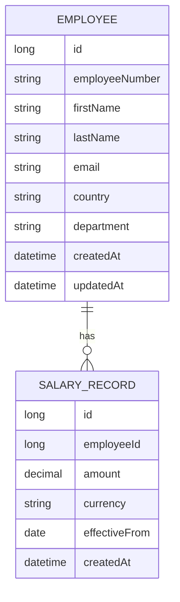

# Salary Management System — Domain Model

## Employee

Represents a person employed by the organization.

Suggested fields:

- `id` — surrogate primary key.
- `employeeNumber` — unique business identifier for the employee.
- `firstName`
- `lastName`
- `email`
- `country`
- `department`
- `createdAt`
- `updatedAt`

`employeeNumber` must be unique across all employees.

No additional employee fields (e.g., job title, manager, employment status) are introduced beyond what the requirements specify.

## SalaryRecord

Represents a single salary entry for an employee, effective from a given date.

Suggested fields:

- `id` — surrogate primary key.
- `employee` — the employee this salary record belongs to.
- `amount` — the salary amount; must represent a positive monetary value.
- `currency` — the currency of the salary amount.
- `effectiveFrom` — the date from which this salary amount applies.
- `createdAt`

A `SalaryRecord` always belongs to exactly one `Employee`. Salary history is preserved by creating a new `SalaryRecord` for every salary change rather than modifying or deleting existing records.

## Relationships

```
Employee 1 → many SalaryRecord
```

An `Employee` can have multiple `SalaryRecord`s over time, representing the history of salary changes.

The employee's **current salary** is a derived value: it is the `SalaryRecord` with the latest applicable `effectiveFrom` date (i.e., the most recent effective date that is not in the future) for that employee. It is computed by querying salary records ordered by `effectiveFrom`, not stored as a duplicated field on `Employee`. No separate `CurrentSalary` entity is introduced.

## Domain Rules

1. Employee number must be unique.
2. Salary amount must be positive.
3. Salary history must be preserved — salary changes are recorded as new `SalaryRecord`s, never as overwrites of existing records.
4. A salary record must belong to an existing employee.
5. Salary effective date (`effectiveFrom`) is required.
6. Currency is required.
7. Employee required fields must be validated (e.g., employee number, name fields present and well-formed).
8. Salary records should be ordered by effective date when salary history is retrieved.

## Database Considerations

Key persistence relationships:

- `salary_record.employee_id` is a foreign key referencing `employee.id`, enforcing that every salary record belongs to an existing employee.
- Deleting an employee's related salary history is not addressed here, as employee deletion is not a specified requirement.

Potential indexes, each justified by a specific query/use case:

- `employee.employee_number` (unique index) — supports uniqueness enforcement and fast lookup/search by employee number.
- `employee.country` — supports filtering employees by country.
- `employee.department` — supports filtering employees by department.
- `salary_record.employee_id` — supports efficiently retrieving an employee's salary history and deriving current salary.
- `salary_record.effective_from` — supports ordering/filtering salary records by effective date, including finding the latest applicable record.

No additional indexes are proposed beyond those with a clear, current query justification.

## Domain Model Diagram


